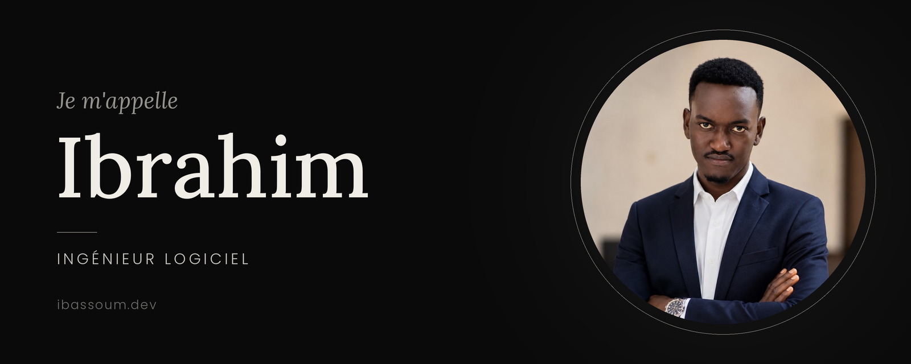

<!-- ═══════════════ HEADER ANIMÉ ═══════════════ -->

  

<!-- ═══════════════ BOUTON PORTFOLIO ═══════════════ -->

  

<!-- ═══════════════ NAVIGATION ═══════════════ -->

  <a href="#-à-propos">À propos</a> •
  <a href="#-ce-que-je-fais">Ce que je fais</a> •
  <a href="#-stack-technique">Stack</a> •
  <a href="#-projets">Projets</a> •
  <a href="#-statistiques-github">Stats</a> •
  <a href="#-contact">Contact</a>

## 👨‍💻 À propos

> Je conçois et développe des **applications web**, **mobiles** et des **architectures backend performantes**.
> Du code à la modélisation de bases de données, en passant par l'intégration d'IA locales et la gestion d'infrastructures conteneurisées, j'aime transformer des problèmes complexes en solutions fluides et élégantes.

- 🎓 Étudiant en **Génie Logiciel** à l'**INTEC-SUP**
- 🏗️ Passionné par la **Clean Architecture** et le **DDD**
- 🤖 J'expérimente avec des **LLM locaux** dans mes workflows de développement
- 🌍 Basé en Afrique de l'Ouest, ouvert aux collaborations à distance

## ⚡ Ce que je fais

<table>
  <tr>
    <td width="50%" valign="top">
      <h3>🛠️ Backend &amp; Mobile</h3>
      Architectures propres (<i>Clean Architecture</i>, DDD) avec <b>Java (Spring Boot)</b>, <b>PHP (Laravel)</b> et <b>Dart (Flutter / Riverpod)</b>.
    </td>
    <td width="50%" valign="top">
      <h3>🎨 UI/UX &amp; Prototypage</h3>
      Interfaces modernes prototypées sous <b>Figma</b> et intégrées dynamiquement avec <b>Livewire</b> et <b>Blade</b>.
    </td>
  </tr>
  <tr>
    <td width="50%" valign="top">
      <h3>🐳 DevOps &amp; Données</h3>
      Services conteneurisés avec <b>Docker</b>, workflows automatisés sur macOS/Linux, bases de données <b>MySQL</b> et <b>PostgreSQL</b>.
    </td>
    <td width="50%" valign="top">
      <h3>🤖 IA &amp; Outils Dev</h3>
      Intégration de modèles locaux (<b>Ollama</b>, <b>LM Studio</b>) couplés à des environnements de développement intelligents.
    </td>
  </tr>
</table>

## 🧰 Stack Technique

<b>💬 Langages &amp; Frameworks</b>

 

  
  
  
  
  
  
  
  

<b>🗄️ Bases de Données &amp; DevOps</b>

 

  
  
  
  

<b>🎨 Environnement &amp; Outils de Création</b>

 

  
  
  
  
  

## 📌 Projets

| 🚀 Projet | 📝 Description | 🧩 Tech Stack |
| :--- | :--- | :--- |
| **MaliServices** | Plateforme de services web : de l'analyse des besoins à l'architecture API et au design UI. | `Laravel` `Figma` `REST API` |
| **FermePro** | Suivi et gestion des opérations agricoles et des stocks. | `Laravel` `Livewire` `MySQL` |
| **ProjectLens & LogLens** | Analyse de code (AST) et traitement de logs avec traduction/assistance IA. | `Java` `Flutter` `LLM locaux` |
| **Cash-Flow** | Gestion financière suivant les principes de la *Clean Architecture*. | `Flutter` `Riverpod` `Dart` |

  

## 📈 Statistiques GitHub

  
  

  

  

## 🤝 Contact

  <em>Un projet, une idée, une collaboration ? Parlons-en !</em>

  
  
  

> 💡 *« Le bon code est sa propre meilleure documentation. »*

